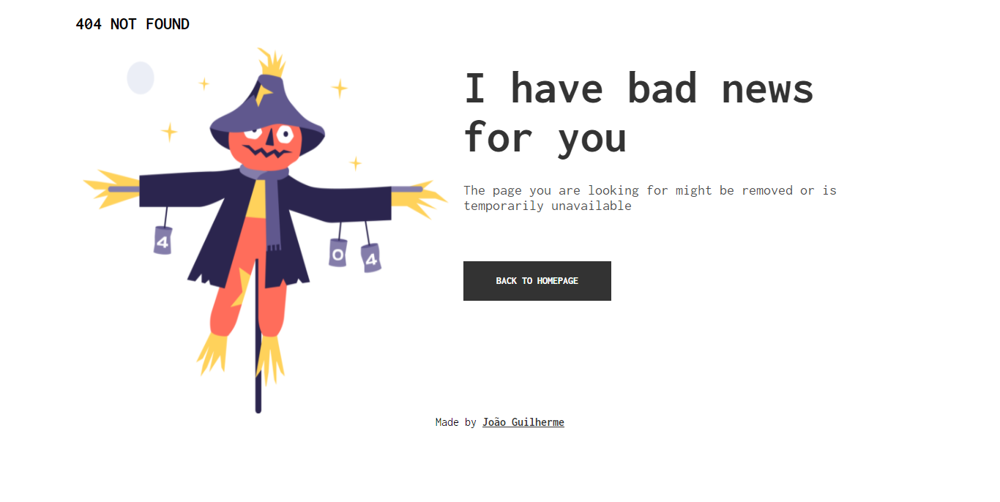

  
 Title : 404 Error Not Found

## About 
//TODO #1 corrigir link de submissão
My [submission](https://devchallenges.io/solutions/prI026pn0R1uOOh9xPDS) for the [DevChallenges](https://devchallenges.io/).

[Check Live](https://joaogalvesluiz.netlify.app/websites/404-not-found-master/index.html)

- Challenge 
  - Create a 404 not foudn page following the design. The page should be responsive. Dont' look at the existing solution. Fulfill user stories below:

- User story: 
  - I can see a page following the given design  

