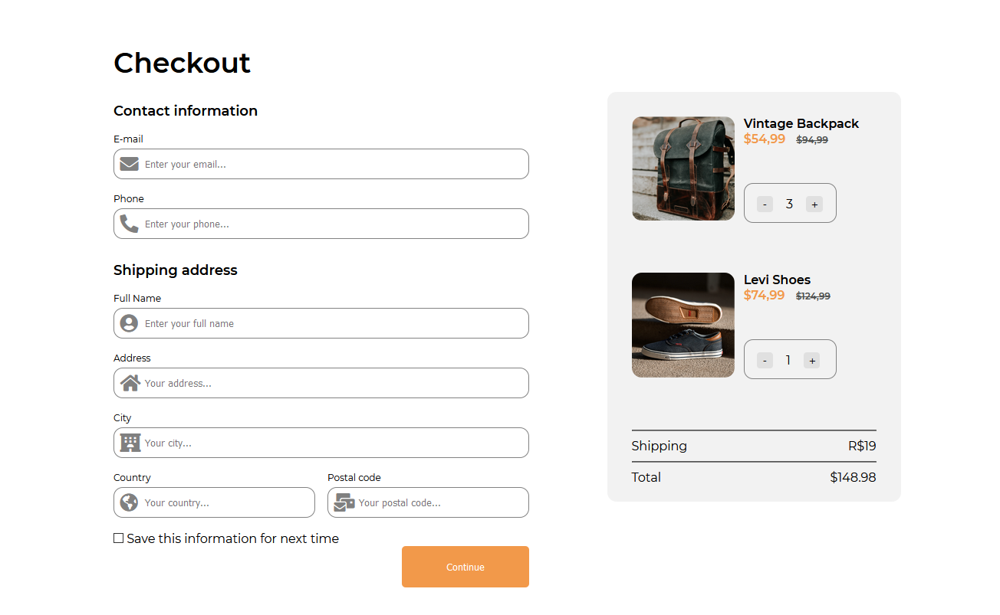

<!-- Title --> 
# Checkout Page

<!-- Project Image --> 

  

<!-- Submissions Links --> 
## Submission
//TODO #2 corrigir link de submissão
My [submission](https://devchallenges.io/solutions/prI026pn0R1uOOh9xPDS) for the [DevChallenges](https://devchallenges.io/).

<!-- About the Challenge --> 
## About the Challenge

- Challenge 
  Create a checkout page following the design. You don’t need to use JS in this challenge but use correct input types and validation. Don’t look at the existing solution. Fulfill user stories below:

- User story: 
    I can see a page following the given design
    I can input email, phone, full name, address, city, country, and postal code
    I can input the number of items
    When I click submit button or press enter, I can see a warning if validation fails
    When I click submit button or press enter, I can see a successful alert if validation succeeds

<!-- Features Used in --> 
## Features Used 

<!-- See website --> 
[Check Live](https://joaogalvesluiz.netlify.app/websites/checkout-page/index.html)
### Contact
E-mail: joaog.alvesluiz@gmail.com