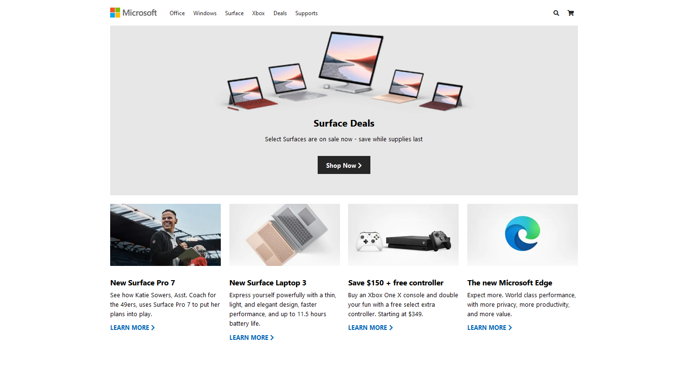

# Microsoft Homepage

  

##### Tutorial by Traversy Media
## About 

In this project we will build our own version of the Microsoft homepage using HTML5/CSS and a bit of JS for the menu. You will learn about modern CSS including CSS grid, flexbox and responsive media queries.

[Check Live](https://joaogalvesluiz.netlify.app/websites/microsoft-pageclone/index.html)

[Video](https://www.youtube.com/watch?v=uKgn-To1C4Q&feature=youtu.be)

### Contact
E-mail: joaog.alvesluiz@gmail.com
