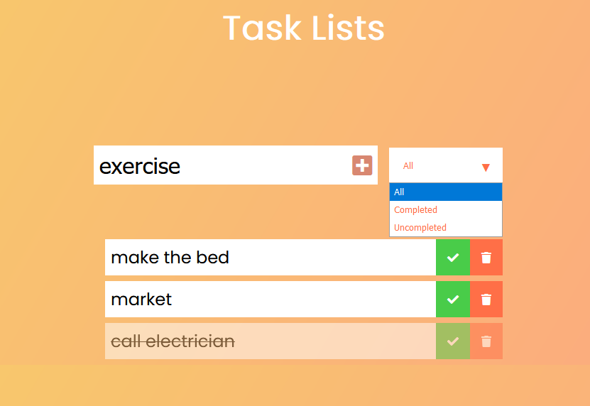

# Task List

  

##### Tutorial by Dev Ed
## About 

In this episode we are going to cover a small project of the full Creative Javascript Course, a todo list in vanilla js.  
We are going to put together all the fundamental javascript techniques including local storage.  
Check out the javascript course in the link above to create more complex javascript projects and understand complex topics.

* Filter for tasks 
  * All, Completed and Uncompleted
* saving in localStorage

[Check Live](https://joaogalvesluiz.netlify.app/websites/tasklist-app/index.html)

[Video](https://www.youtube.com/watch?v=Ttf3CEsEwMQ&feature)

### Contact
E-mail: joaog.alvesluiz@gmail.com
